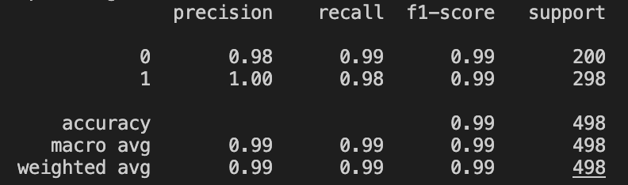

# AI-Generated Phishing Detection: Evaluating the Impact of Large Language Models on Traditional Email Security

## Overview

Phishing remains one of the most common cyberattacks used to steal credentials, distribute malware, and gain unauthorized access to sensitive information. In the past, phishing emails were often characterized by poor grammar, suspicious links, and obvious social engineering tactics. However, the emergence of Large Language Models (LLMs) has significantly changed the threat landscape, enabling attackers to generate highly polished and convincing phishing content at scale.

This project investigates whether traditional phishing detection models can effectively generalize to AI-generated phishing emails and explores how incorporating AI-generated phishing examples into training datasets affects detection performance.

---

## Research Questions

1. Can we build a model that effectively predicts whether an email (human- or llm-generated) is legit or phishing?
2. Can a phishing detection model trained on traditional (human-generated) phishing emails effectively detect AI-generated phishing emails?
3. How much AI-generated phishing data is required before model performance improves?
4. Are there linguistic differences between human-generated and AI-generated phishing emails?
5. Can we identify which AI models produce phishing emails that are more difficult to detect?

---

## Dataset

The original dataset from [Kaggle](https://www.kaggle.com/datasets/francescogreco97/human-llm-generated-phishing-legitimate-emails?resource=download). It contains:

| Source           | Legitimate | Phishing |
|------------------|------------|----------|
| Human-generated  | 1000       | 1000     |
| LLM-generated    | 1000       | 1000     |

The LLM-generated emails were produced using ChatGPT and WormGPT. Instead of using this dataset, I generated 1500 phishing emails using multiple AI agents:

- ChatGPT
- Microsoft Copilot
- Claude
- Grok

Generated phishing scenarios included:

- Credential Theft
- Banking Fraud
- Security Alerts
- Package Delivery Notifications
- Human Resources Communications
- Invoice Fraud
- Account Verification Requests
- Password Reset Requests

These emails ranged in quality, from obvious grammatical and spelling mistakes to highly professional and legitimate-sounding emails. 

---

## Data Preprocessing

All emails were standardized into a common format:

- clean_text
- label
- source
- label_id

Preprocessing included:

- Lowercasing
- URL replacement
- Email address replacement
- Number normalization
- Removal of special characters
- Whitespace normalization

---

## Baseline Model

### Model

1. TF-IDF Vectorization
2. Linear Support Vector Classification (had started with a Logistic Regression Classifier, but SVC returned higher AUROC scores)

### Random Train/test Split

A standard stratified train/test split was performed across the entire dataset.

Results

On human data:

- Accuracy: ~99.7%
- Precision: ~99%
- Recall: ~100%
- F1 Score: ~99%

On LLM data:

- Accuracy: ~99.7%
- Precision: ~100%
- Recall: ~100%
- F1 Score: ~100%

---

## Error Analysis

Only two emails were incorrectly classified.

### False Negatives

Both misclassified emails:

- Were human-generated phishing emails
- Were incorrectly labeled as legitimate
- Contained language focused on low-priced pharmaceutical or medication purchases

Interestingly, no AI-generated phishing emails appeared among the model's misclassifications during the random split evaluation.

---

## Human-to-LLM Experiment

### Research Question

Traditional phishing detection systems are largely trained on historical phishing datasets created before widespread adoption of LLMs. This experiment evaluates whether a detector trained exclusively on human-generated emails can generalize to AI-generated phishing emails.

### Experimental Design

Training Data:

- Human Legitimate Emails
- Human Phishing Emails

Testing Data:

- LLM Legitimate Emails
- LLM Phishing Emails

### Results

| Experiment                         | AUROC |
|------------------------------------|-------|
| Human-> LLM (original dataset)     | 0.40  |
| Human --> LLM (all_AI combined)    | 0.61  |

### Key Findings

A phishing detector trained solely on traditional phishing data struggles to generalize to AI-generated phishing attacks. However, introducing additional AI-generated phishing examples substantially improved performance, increasing AUROC from 0.40 to 0.61. This suggests that modern phishing detection systems may require continual retraining using AI-generated attack samples as the threat landscape evolves.

Model training and testing was done on three batches of data: with the original llm_generated phishing dataset from Kaggle, with a llm-generated dataset of 750 examples across 4 different AI agents, and 1500 examples (an additional 750 to the previous 750 record dataset). Adding an additional 750 records allowed for more lingiustic variety and scam types.

| Experiment                         | AUROC |
|------------------------------------|-------|
| Original Dataset (from Kaggle)     | 0.40  |
| 750 Newly Generated Dataset        | 0.61  |
| 1500 Records Dataset               | 0.904 |


---

## AI Agent-Specific Evaluation

Compare phishing emails generated by:

- ChatGPT
- Claude
- Copilot
- Grok

Different large language models may produce phishing emails with distinct writing styles, levels of sophistication, and linguistic patterns.

This experiment investigates whether phishing emails generated by different AI agents are equally difficult for a human-trained phishing detector to identify. Research question:

- Which AI model generates the most difficult phishing emails to detect?

### Experimental Design

A Support Vector Machine (SVM) classifier was trained exclusively on human-generated emails and then evaluated against phishing emails generated by four different AI agents. The model's average decision score was used as a proxy for phishing confidence. Higher scores indicate that the classifier was more confident that an email was phishing, while lower scores suggest that the email appeared more legitimate and was therefore more difficult to detect.

### Results

| AI Agent  | Average Phishing Confidence Score |
|---------- |-----------------------------------|
| ChatGPT   | 0.316                             |
| Copilot   | 0.542                             |
| Claude    | 0.407                             |
| Grok      | 0.618                             |

### Key Findings

Not all AI-generated phishing emails are equally detectable. Among the models evaluated, ChatGPT-generated phishing emails appeared most similar to legitimate communications from the perspective of a human-trained detector, while Grok-generated phishing emails were the easiest to identify as phishing. This highlights the importance of evaluating phishing defenses across multiple different AI systems rather than treating AI-generated phishing as a single category.

---

## Human vs. AI-Generated Phishing

### Research Question

As large language models become increasingly capable of generating convincing phishing emails, an important question emerges: can we reliably determine whether a phishing email was written by a human attacker or generated by an AI system?

While most phishing research focuses on identifying whether an email is malicious, this experiment investigates whether AI-generated phishing presents linguistic characteristics that distinguish it from traditional, human-written phishing campaigns.

### Experimental Design

A new classification task was created using only phishing emails. This utilized my existing human-generated/phishing.csv dataset, as well as my llm-generated/phishing.csv dataset. 

The original phishing-vs-legitimate labels were replaced with a new target variable:

| Label | Label Meaning            |
|-------|--------------------------|
| 0     | Human-generated phishing |
| 1     | AI-generated phishing    |

A TF-IDF vectorization pipeline was used to convert email text into numerical features.

### Results

Classification Report:



The classifier achieved near-perfect performance in distinguishing human-generated phishing emails from AI-generated phishing emails.

#### Most "Human" Features

The following features were most strongly associated with human-generated phishing emails based on the learned coefficients from the logistic regression model trained on TF-IDF features. Negative coefficient values indicate terms that were more predictive of the human phishing class:

| Feature  | Coef value |
|----------|------------|
| email    | -3.604     |
| mail     | -2.501     |
| utf      | -2.127     |
| online   | -1.763     |
| update   | -1.580     |
| mailbox  | -1.543     |
| pdf      | -1.316     |
| reserved | -1.274     |
| onedrive | -1.259     |
| click    | -1.221     |

The following features were most strongly associated with AI-generated phishing emails:

| Feature      | Coef value |
|--------------|------------|
| review       | 3.629      |
| redacted     | 3.229      |
| reference    | 2.296      |
| hr           | 2.035      |
| invoice      | 1.992      |
| issue        | 1.749      |
| verification | 1.734      |
| number       | 1.600      |
| urgent       | 1.589      |
| records      | 1.550      |


### Key Findings

1. AI-generated phishing exhibits detectable linguistic patterns: the classifier was able to distinguish between human and AI-generated phishing with extremely high accuracy, suggesting that AI-generated phishing emails currently contain consistent stylistic signals that differ from traditional phishing campaigns.

2. AI phishing tends to be more formal: features such as verification, confirmation, records, identity, and review appeared frequently in AI-generated phishing emails. This suggests that many LLM-generated phishing emails rely on professional, administrative language designed to create urgency and legitimacy.

3. Human phishing more frequently imitates real services: human-generated phishing emails were more likely to reference specific platforms, services, and brands, including terms such as PayPal, OneDrive, mailbox, and online. This aligns with real-world phishing campaigns that target specific organizations or user accounts.

---

## Phishing Email Detection Web App

I've created a basic web application to extend on this ML model that classifies emails as legitimate or phishing, and provides explanations of suspicious features only when phishing is detected.

### How It Works

1. User inputs an email into the web interface
2. Frontend sends the text to the backend via a POST /predict request
3. Backend processes the text using a trained ML/NLP model
4. Model returns:
- Prediction (phishing or legitimate)
- Probability score
- What is suspicious (only if phishing is detected)
5. Frontend dynamically renders:
- Prediction result
- Explanation panel

### How To Run

After cloning repo and installing libraries from requirements.txt, simply:

Run 
```bash
python app.py
```

Then open
```text
http://127.0.0.1:5000
```
in your browser

Input your email text of choice (i.e. body of email), and click 'Analyze Email'!

---

## Technologies

- Python
- Pandas
- NumPy
- Scikit-Learn
- TF-IDF
- Logistic Regression
- Support Vector Machines (SVM)
- Matplotlib
- Jupyter Notebook
- HTML
- CSS
- JavaScript
- Flask

---

## Author

Katherine Li